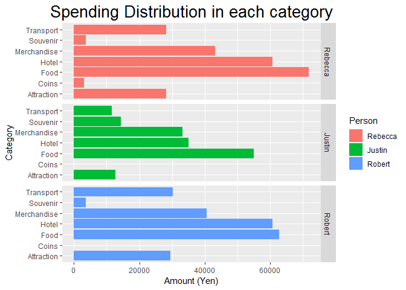
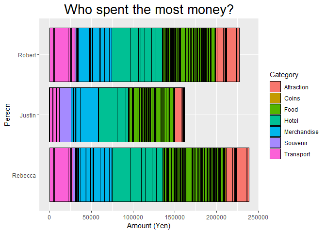
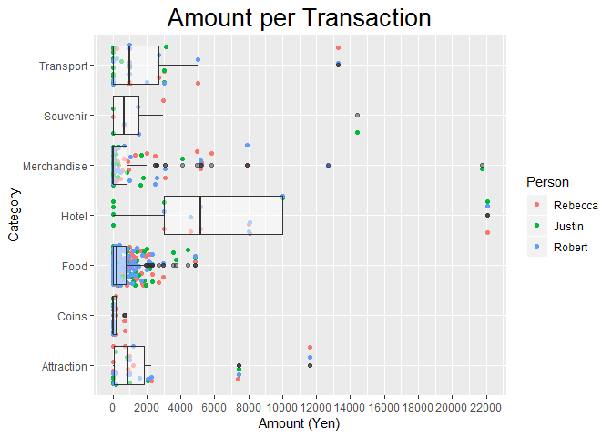

Japan Vacation
================
Robert Yip
September 7, 2018

Scroll to bottom for visualization and summary
----------------------------------------------

Earlier this year, my friends who are budget conscious decided to keep track of every expense that we spent during our trip to Japan. While it took a lot of effort, the result was a small dataset to play with. For my enjoyment, I will clean up the data and visualize simple questions such as who spent the most? In what categories? And so on.

``` r
getwd()
```

    ## [1] "H:/GitHub/Japan-Trip"

``` r
df = read.csv("Japan trip.csv", header = TRUE)
```

Let's take a look at the structure.

``` r
str(df)
```

    ## 'data.frame':    194 obs. of  6 variables:
    ##  $ Date   : int  28 NA NA NA NA NA NA NA 29 NA ...
    ##  $ Item   : Factor w/ 165 levels "100yen","3-day tokyo pass",..: 106 108 142 2 120 89 44 54 151 150 ...
    ##  $ Item.1 : Factor w/ 20 levels "att","attraction",..: 20 20 20 20 11 9 3 9 9 9 ...
    ##  $ Rebecca: int  NA 5000 1000 3000 22080 460 1000 1162 333 2678 ...
    ##  $ Justin : int  500 3000 1000 3000 22080 843 NA NA 333 3542 ...
    ##  $ Robert : int  NA 5000 1000 3000 22080 400 1000 1162 333 2030 ...

``` r
summary(df)
```

    ##       Date                     Item            Item.1      Rebecca       
    ##  Min.   : 1.00   Combini         :  5   Food      :74   Min.   :    0.0  
    ##  1st Qu.: 4.75   Combini         :  5   food      :40   1st Qu.:  202.5  
    ##  Median : 8.50   Conbini         :  4   Merchadise:22   Median :  571.0  
    ##  Mean   :12.25   Penny           :  4   Transport :12   Mean   : 1440.8  
    ##  3rd Qu.:16.00   Vending machine :  4   merchadise: 7   3rd Qu.: 1238.5  
    ##  Max.   :31.00   Daiso           :  3   attraction: 6   Max.   :22080.0  
    ##  NA's   :178     (Other)         :169   (Other)   :33   NA's   :28       
    ##      Justin          Robert       
    ##  Min.   :   86   Min.   :    0.0  
    ##  1st Qu.:  293   1st Qu.:  191.2  
    ##  Median :  810   Median :  620.0  
    ##  Mean   : 1907   Mean   : 1539.1  
    ##  3rd Qu.: 1800   3rd Qu.: 1394.0  
    ##  Max.   :22080   Max.   :22080.0  
    ##  NA's   :109     NA's   :46

``` r
head(df, 10)
```

    ##    Date             Item     Item.1 Rebecca Justin Robert
    ## 1    28            Pasmo  Transport      NA    500     NA
    ## 2    NA     Pasmo reload  Transport    5000   3000   5000
    ## 3    NA       Tokyo bus   Transport    1000   1000   1000
    ## 4    NA 3-day tokyo pass  Transport    3000   3000   3000
    ## 5    NA Prime pod ginza       Hotel   22080  22080  22080
    ## 6    NA           Lawson       Food     460    843    400
    ## 7    NA Doraemon museum  Attraction    1000     NA   1000
    ## 8    NA    FF Osaka cafe       Food    1162     NA   1162
    ## 9    29     Uni scallop        Food     333    333    333
    ## 10   NA    Tsukiji bowls       Food    2678   3542   2030

``` r
tail(df, 10)
```

    ##     Date              Item     Item.1 Rebecca Justin Robert
    ## 185   NA       Don quixote Merchadise    5804     NA   2620
    ## 186   NA              Crab       Food    2950     NA   2950
    ## 187   NA       Pasmo load   Transport    1000     NA   1000
    ## 188   NA Washington hotel       Hotel    8000     NA   8000
    ## 189   NA         Pancakes        Food     200     NA    200
    ## 190   NA            Trial  Merchadise    3090     NA   3090
    ## 191   NA        Mcdonalds        Food       0     NA    640
    ## 192   NA          Combini  Merchadise     250     NA      0
    ## 193   NA        Souvenirs    Souvenir       0     NA   1500
    ## 194   NA            Uniqlo Merchadise       0     NA   2580

First I will fix the date column. As records are collected and appended, the dates were left empty until the next day to save time, hence the NAs. I will copy the previous date first using na.locf, and then correct the date format.

``` r
library(zoo)
```

    ## 
    ## Attaching package: 'zoo'

    ## The following objects are masked from 'package:base':
    ## 
    ##     as.Date, as.Date.numeric

``` r
df$Date <- na.locf(df$Date)
head(df, 5)  
```

    ##   Date             Item    Item.1 Rebecca Justin Robert
    ## 1   28            Pasmo Transport      NA    500     NA
    ## 2   28     Pasmo reload Transport    5000   3000   5000
    ## 3   28       Tokyo bus  Transport    1000   1000   1000
    ## 4   28 3-day tokyo pass Transport    3000   3000   3000
    ## 5   28 Prime pod ginza      Hotel   22080  22080  22080

The dates occured in March and April, so let's add back the year and month so we can transform it into date format. Current data type is in integer. I first convert it to character for the manipulation before finally converting into date.

``` r
typeof(df$Date) 
```

    ## [1] "integer"

``` r
#Need to create T/F vector for group of dates to apply, otherwise data type will change
G1 <- df$Date >= 28                    #For the month of March, from my arrival date
G2 <- df$Date < 10                     #For the month of April before the 10th.
G3 <- df$Date >=10 & df$Date <=15      #For the month of April until departure.

df$Date[G1] <- paste0("2018-03-", df$Date[G1])
df$Date[G2] <- paste0("2018-04-0", df$Date[G2])
df$Date[G3] <- paste0("2018-04-", df$Date[G3])

df$Date <- as.Date(df$Date)
head(df, 5)  
```

    ##         Date             Item    Item.1 Rebecca Justin Robert
    ## 1 2018-03-28            Pasmo Transport      NA    500     NA
    ## 2 2018-03-28     Pasmo reload Transport    5000   3000   5000
    ## 3 2018-03-28       Tokyo bus  Transport    1000   1000   1000
    ## 4 2018-03-28 3-day tokyo pass Transport    3000   3000   3000
    ## 5 2018-03-28 Prime pod ginza      Hotel   22080  22080  22080

Much better! Moving on, we can skip the item column because it won't be used in the analysis. More importantly, the let's rename Item.1 to "Category" and confirm if the data is clean.

``` r
colnames(df)[colnames(df)=="Item.1"] <- "Category"
df$Category <- as.factor(df$Category)
is.factor(df$Category)
```

    ## [1] TRUE

``` r
levels(df$Category)
```

    ##  [1] "att"         "attraction"  "Attraction"  "coins"       "Coins"      
    ##  [6] "Fod"         "foo"         "food"        "Food"        "hotel"      
    ## [11] "Hotel"       "merchadise"  "Merchadise"  "merchandise" "merchanidse"
    ## [16] "merchdise"   "souvenir"    "Souvenir"    "transport"   "Transport"

We see that it is already in factor form, but there's some different casing and even spelling errors! Fortunately, all the first letters of each category is correct and unique. We can fix it by running a simple regular expression to capture the first character. Rather than typing everything out, I use a for loop to fix every category.

``` r
fix_StartWith <-  c("aA", "cC", "fF", "hH", "mM", "sS", "tT")
fix_StartWith <- paste0("^[", fix_StartWith, "]") #To add the regex conditions
fix_ReplaceWith <- c("Attraction", "Coins", "Food", "Hotel", "Merchandise", "Souvenir", "Transport")

for (i in 1:7){
  levels(df$Category)[grepl(fix_StartWith[i], levels(df$Category))] <- fix_ReplaceWith[i]
}

  levels(df$Category)
```

    ## [1] "Attraction"  "Coins"       "Food"        "Hotel"       "Merchandise"
    ## [6] "Souvenir"    "Transport"

We are almost done. Finally, let's change each NA value to 0 for each person so it can be useful.

``` r
df[4:6][is.na(df[4:6])] <- 0
```

Now the data is ready to be graphed! Let's first write it to a clean file.

``` r
write.csv(df, file = "Japan Trip Cleaned.csv")
```

Visualization and Analysis
--------------------------

We will visualize our data with ggplot here.

``` r
library(ggplot2)
library(dplyr)
```

    ## 
    ## Attaching package: 'dplyr'

    ## The following objects are masked from 'package:stats':
    ## 
    ##     filter, lag

    ## The following objects are masked from 'package:base':
    ## 
    ##     intersect, setdiff, setequal, union

``` r
library(reshape2) #To make data flat
```

First we need to melt the data to flatten the data for analysis.

``` r
dfmelt <- melt(df, id.vars = c("Date", "Item", "Category"), 
               variable.name="Person", 
               value.name = "Amount") 
head(dfmelt)
```

    ##         Date             Item  Category  Person Amount
    ## 1 2018-03-28            Pasmo Transport Rebecca      0
    ## 2 2018-03-28     Pasmo reload Transport Rebecca   5000
    ## 3 2018-03-28       Tokyo bus  Transport Rebecca   1000
    ## 4 2018-03-28 3-day tokyo pass Transport Rebecca   3000
    ## 5 2018-03-28 Prime pod ginza      Hotel Rebecca  22080
    ## 6 2018-03-28           Lawson      Food Rebecca    460

We are ready to plot! First let's see the spending distribution of each category for each person. Note: I flipped the axis so the category labels will not overlap.

``` r
ggplot(data=dfmelt, aes(x = Category, y = Amount)) +
   geom_col(aes(fill = Person)) + 
   coord_flip(xlim = NULL, ylim = NULL, expand = TRUE, clip = "on") +
   facet_grid(Person~.) +
   ggtitle("Spending Distribution in each category") +
   ylab("Amount (Yen)") +
   theme(
     plot.title = element_text(size = 20, hjust = 0.5)
   )
```



Consistent across all members, food is the highest expense, followed by hotel. Attractions and Transportation spending is roughly equal at a moderate amount. Rebecca is the only person that collects coins.

Next question we can ask is, who spent the most money?

``` r
ggplot(data=dfmelt, aes(x = Person, y = Amount)) +
   geom_col(aes(fill = Category), colour = "black") + 
   coord_flip(xlim = NULL, ylim = NULL, expand = TRUE, clip = "on") +
   ggtitle("Who spent the most money?") +
   ylab("Amount (Yen)") +
   theme(
     plot.title = element_text(size = 20, hjust = 0.5)
   )
```



We see Rebecca spent the most and Justin spent the least. (The truth is, he left early and didn't stay the entire trip)

There's two other features included in this graph. One is, the categories are included to show the weight of the distribution in that category. The second is, adding the black line borders allows us to visualize the average amount of a transaction in each category. For example, each transaction in food is on the cheap side, whereas each hotel transaction is expensive.

We can actually improve the detail of the above graph if we visualize by using a boxplot instead.

``` r
ggplot(data=dfmelt, aes(x = Category, y = Amount)) +
   geom_jitter(aes(colour = Person)) + 
   geom_boxplot(alpha = 0.5) +
   coord_flip(xlim = NULL, ylim = NULL, expand = TRUE, clip = "on") +
   ggtitle("Amount per Transaction") +
   ylab("Amount (Yen)") +
   scale_y_continuous(breaks = pretty(dfmelt$Amount, n = 10)) +
   theme(
     plot.title = element_text(size = 20, hjust = 0.5)
   )
```



With the boxplot, we see a lot more details such as the median cost of the transaction (middle of box), 25th/75th percentiles, and even some outliers.

Summary
=======

We cleaned and visualized the expense data for my collection. We asked some simple questions such as who spent the most and how much were spent in the different type of expenses. Hope it was an enjoyable read!
